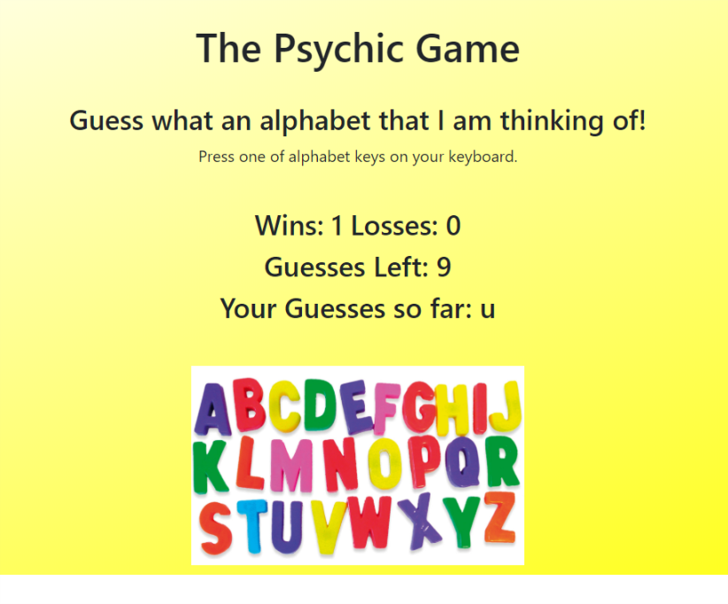

# Psychic-Game

This project is called "Psychic-Game." User will guess an alphabet from a keyboard. 
If user guess the same with a computer choice, then the user get a winning score.
User has 10 times to guess. After 10 times missed, the game it re-start a new round. 

# Picture of Project

Click on the following link to preview the completed assignment.  

## Built With

* HTML5
* CSS3
* JavaScript 

